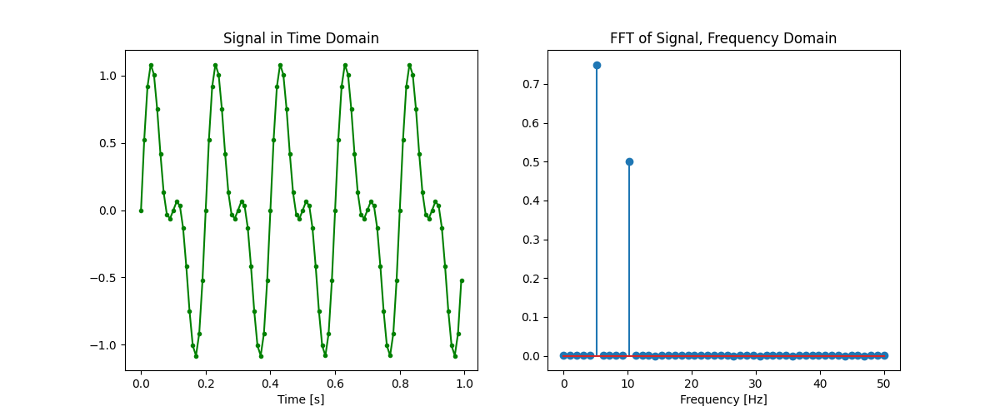
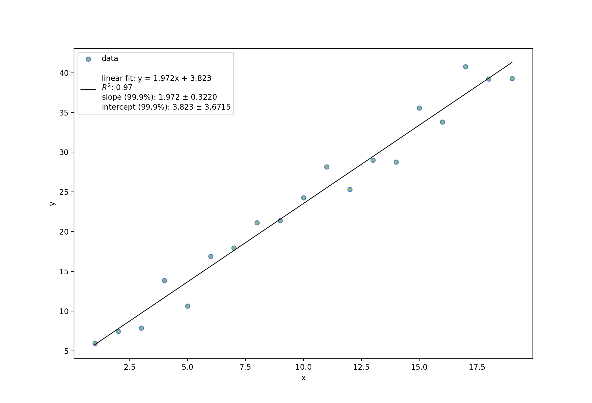
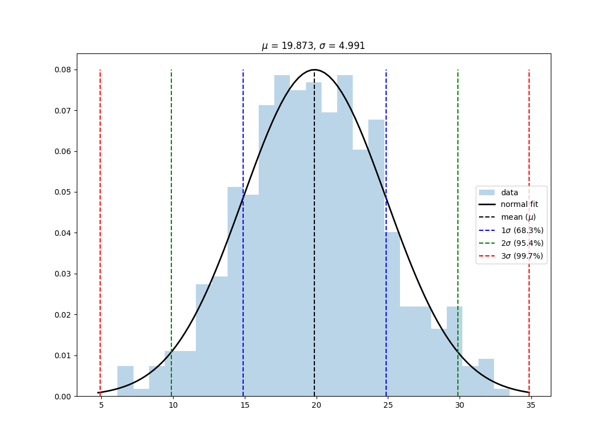

# Python Tools for Engineers

My Python tools for engineers - especially those involved in R&D and experimental methods

by Justin @ [github.com/justinmitchelltech/jmpytools](https://github.com/justinmitchelltech/jmpytools) 

 

# Contents

<!------------------------------------------------------------------------------------------------->
## [General-purpose Tools](/genpurpose)

[Loading Bar](/genpurpose/loading.py) (including usage [examples](/genpurpose/loading_examples.py))

  

[Markdown tables from csv's or Pandas DataFrames](/genpurpose/mdtables.py) (including usage [examples](/genpurpose/mdtables_examples.py) + [output](/genpurpose/mdtables_examples.md) example) 

 

<!------------------------------------------------------------------------------------------------->
## [Tools for Engineering Analysis](/analysis)

[FFT - Fast Fourier Transform](/analysis/fft.py) (including usage [example](/analysis/fft_example.py))

  

[Linear Regressions](/analysis/linear.py) (including usage [examples](/analysis/linear_examples.py))

  

  

[Normal Distributions](/analysis/normal.py) (including usage [examples](/analysis/normal_examples.py))

  

