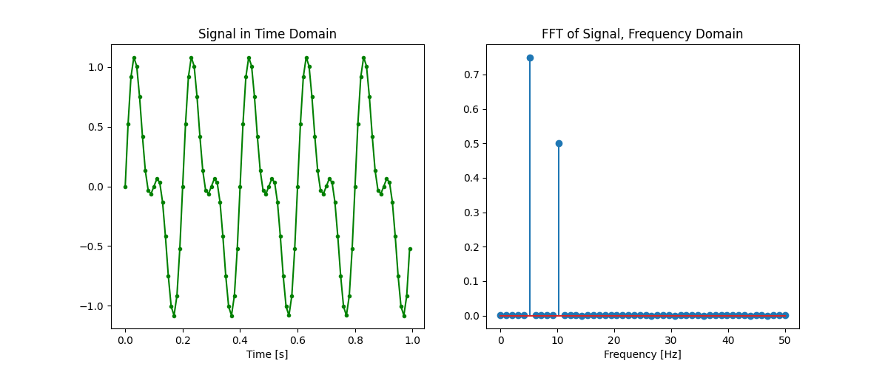

# pytools 

by Justin @ [github.com/justinmitchelltech/pytools](https://github.com/justinmitchelltech/pytools) 

 

# Contents

## [Engineering Tools](/engineering)

* [Fast Fourier Transform (FFT)](/engineering/fft.py)
    * [example](/engineering/fft_example.py)

  

## [Statistical Tools](/statistics)
* [Normal Distributions](/statiscs/normal.py)
  * [example](/statistics/normal_examples.py)

  

## [Markdown Tools](/markdown)

* [Tables from csv's or Pandas DataFrames](/markdown/tables.py)
    * [example](/markdown/tables_example.py) > [output](/markdown/tables_example.md)
